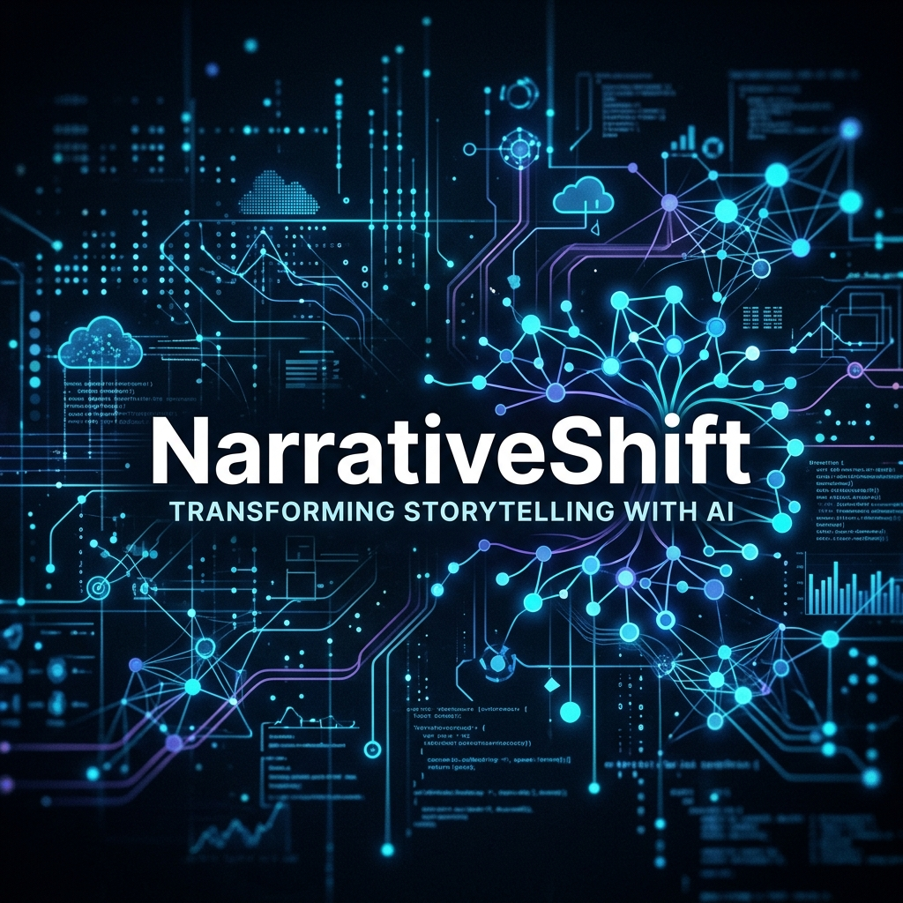
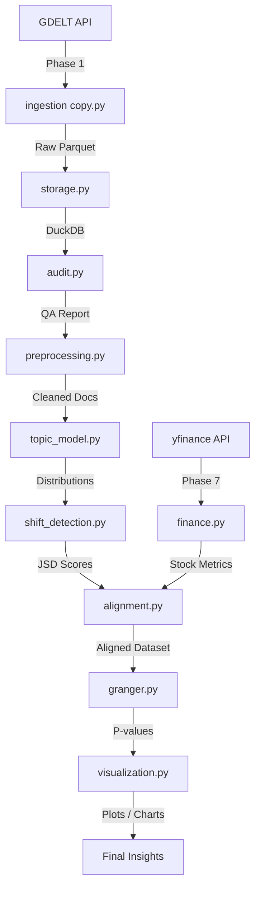

# 📰 NarrativeShift Project

[](https://www.python.org/)
[](LICENSE)
[](https://maartengr.github.io/BERTopic/)
[](https://duckdb.org/)

**Detecting narrative shifts in Reliance Jio media coverage (2022–2024) using GDELT, BERTopic, and Jensen-Shannon Divergence.**

A fully automated NLP research pipeline that collects news articles, models weekly topic distributions, and detects when the dominant media narrative around Reliance Jio meaningfully changes over time.

---

## ✨ Key Features

- **Automated Ingestion**: Pulls thousands of articles from **GDELT DOC 2.0 API**.
- **Full-Text Extraction**: Uses `newspaper3k` to retrieve actual content from news URLs.
- **Analytical Storage**: Powered by **DuckDB** for fast, local SQL-on-Parquet queries.
- **Dynamic Topic Modeling**: Employs **BERTopic** with a unique **per-week modeling** approach to capture evolving narratives.
- **Shift Detection**: Quantifies narrative change using **Jensen-Shannon Divergence (JSD)** between consecutive topic distributions.
- **Visual Auditing**: Built-in data quality checks and coverage visualization.
- **Portable Paths**: All file paths are resolved dynamically using `pathlib` — no hard-coded paths anywhere.

---

## 🏗️ Architecture



---

## 📊 Pipeline Overview

| Phase | Script | Input | Output | Description |
| :--- | :--- | :--- | :--- | :--- |
| **1** | `ingestion copy.py` | GDELT API | `data/raw/*.parquet` | Collects articles & extracts full text via newspaper3k. |
| **2** | `storage.py` | Raw Parquet | `data/articles.duckdb` | Deduplicates & stores in DuckDB with indexes. |
| **3** | `audit.py` | DuckDB | Console report + `plots/audit_coverage.png` | Validates coverage, source diversity & content quality. |
| **4** | `preprocessing.py` | DuckDB | Weekly document groups (in-memory) | Cleans text, filters relevance & groups by ISO week. |
| **5** | `topic_model.py` | Weekly Docs | `data/topic_distributions.parquet` | Fits per-week BERTopic models & extracts distributions. |
| **6** | `shift_detection.py` | Topic Parquet | `data/narrative_shift.parquet` | Computes JSD & identifies spike weeks (z > 1.5). |
| **7** | `finance.py` | yfinance API | `data/financial_metrics.parquet` | Downloads RELIANCE.NS & ^NSEI returns/volatility. |
| **8** | `alignment.py` | Parquet files | `data/aligned_final.parquet` | Merges datasets and handles stationarity tests (ADF/KPSS). |
| **9** | `granger.py` | Aligned Parquet | `data/granger_results.parquet` | Tests predictive relationships using Granger causality. |
| **10** | `visualization.py` | Parquet files | `plots/*.png` | Generates diagnostic and thesis overlay charts. |
| **11** | `README.md` | Final Results | Writeup & Insights | Factual narrative shift analysis & limitations report. |

---

## 🚀 Getting Started

### 1. Prerequisites
- **Python 3.10+** (3.11 recommended)
- **RAM**: 8 GB+ (for BERT embeddings)
- **Disk**: 5 GB+ (for data storage)
- **GPU** *(optional)*: CUDA-compatible GPU accelerates sentence-transformer embeddings

### 2. Installation
```bash
# Clone the repository
git clone https://github.com/YOUR_USERNAME/NarrativeShiftProject.git
cd NarrativeShiftProject

# Create and activate virtual environment
python -m venv venv
source venv/bin/activate  # On Windows: .\venv\Scripts\Activate.ps1

# Install dependencies
pip install -r requirements.txt
```

### 3. Verification
```bash
python -c "import bertopic, duckdb, newspaper, torch; print('Pipeline environment OK')"
```

---

## ⚙️ Configuration

### Environment Variables
Create a `.env` file in the project root:
```env
NEWSAPI_KEY=your_key_here  # Optional for GDELT flow
```

### Keyword Customization
Modify `COMPANY_TERMS` and `SECTOR_TERMS` in `src/ingestion copy.py` to target different entities or sectors.

---

## 🛠️ Usage (Step-by-Step)

### Phase 1: Data Ingestion
```bash
python "src/ingestion copy.py" 2022-01-01 2024-01-01
```
Fetches articles from GDELT and extracts full text. Saves batches to `data/raw/`.

### Phase 2: Storage
```bash
python src/storage.py
```
Loads raw Parquet files into DuckDB with deduplication and indexing.

### Phase 3: Data Audit
```bash
python src/audit.py
```
Generates a quality report: coverage gaps, source diversity, near-duplicate detection, and a coverage chart.

### Phase 4–5: Preprocessing & Topic Modeling
```bash
python src/topic_model.py
```
Runs preprocessing (Phase 4) internally, then fits per-week BERTopic models and saves `topic_distributions.parquet`.

### Phase 6: Shift Detection
```bash
python src/shift_detection.py
```
Computes Jensen-Shannon Divergence between consecutive weeks and identifies narrative spike weeks.

### Phase 7: Financial Data Pipeline
```bash
python src/finance.py --start 2022-01-01 --end 2024-01-01
```
Downloads stock and index metrics from Yahoo Finance and computes weekly return and volatility metrics.

### Phase 8: Alignment & Stationarity
```bash
python src/alignment.py
```
Merges narrative shift scores with financial metrics and applies Augmented Dickey-Fuller (ADF) and Kwiatkowski-Phillips-Schmidt-Shin (KPSS) diagnostics to check for stationarity (differencing if needed).

**Diagnostic Results:**
- **JSD Score**: ADF $p=0.0000$ (rejects unit root) & KPSS $p=0.1000$ (fails to reject trend stationarity) $\rightarrow$ **Stationary** (no differencing needed).
- **Weekly Volatility**: ADF $p=0.0000$ (rejects unit root) & KPSS $p=0.1000$ (fails to reject trend stationarity) $\rightarrow$ **Stationary** (no differencing needed).
- **Output**: Aligned dataset of 154 weeks (spanning `2023-01-09` to `2025-12-29`) saved to `data/aligned_final.parquet`.

### Phase 9: Granger Causality
```bash
python src/granger.py
```
Tests for predictive relationships between narrative shift scores (`jsd_final`) and stock volatility (`volatility_final`) at lags 1–4 weeks. Runs bivariate tests in both directions, and a multivariate Vector Autoregression (VAR) model controlled for broad market movements using NIFTY 50 index returns.

**Granger Causality Results:**
- **Narrative Shift $\rightarrow$ Volatility**: **No significant causality** found at any lag ($p > 0.59$ in bivariate, $p > 0.65$ in controlled models). This aligns with semi-strong market efficiency.
- **Volatility $\rightarrow$ Narrative Shift (Reverse)**: **Significant causality** found at **lag 1** ($F = 4.12, p = 0.044$) and **lag 2** ($F = 3.48, p = 0.033$). This reveals a feedback loop where stock price moves first, and the media shift their narrative focus 1 to 2 weeks later.
- **Output**: Detailed causality statistics saved to `data/granger_results.parquet`.

### Phase 10: Visualization
```bash
python src/visualization.py
```
Generates four publication-quality charts in the `plots/` directory using direct line labeling:
- `plots/narrative_shift.png`: Weekly JSD shift scores annotated with narrative spikes (Z-score > 1.5).
- `plots/volatility.png`: RIL weekly return volatility and 4-week rolling volatility over time.
- `plots/overlay.png` (Hero Chart): Dual y-axis overlay of narrative shift vs stock volatility annotated with Granger test results.
- `plots/topic_evolution.png`: Stacked area chart of the top 5 dominant Jio news topics evolving over time.

---

### Phase 11: Interpretation & Final Findings

#### 📈 Key Research Results
1. **Market Efficiency (News -> Price Link)**: Weekly narrative shifts do *not* Granger-cause stock volatility ($p > 0.59$ in bivariate, $p > 0.65$ in controlled models). This aligns with the **Semi-Strong Form of Market Efficiency**—media news is absorbed and priced in too fast for a weekly model to exploit.
2. **The "Reactive Media" (Price -> News Link)**: Stock volatility **Granger-causes narrative shifts 1 to 2 weeks later** (Lag 1: $p = 0.0441$, Lag 2: $p = 0.0334$). Large stock price moves drive journalists to adapt and shift their reporting focus retroactively to explain the price behavior.

#### 💼 Business Deliverables
- **PR Early-Warning System**: PR and corporate communications teams can monitor weekly stock volatility as a leading indicator to predict exactly when and how media themes will shift over the next 10 days, allowing them to shape the narrative proactively.
- **Methodological Roadmap**: To scale this codebase into a daily predictive trading model (utilizing daily JSD, Parkinson volatility, and FinBERT sentiment), see our detailed [Phase II Roadmap](PHASE_II_ROADMAP.md).

---

### 📊 Interactive Dashboards (Power BI)
```bash
python src/export_excel.py
```
Consolidates all pipeline database records, parquet files, and custom predictive aggregates into a single multi-sheet Excel file at `data/project_outputs.xlsx` for Power BI ingestion.

#### Recommended Dashboard Pages:
1. **GDELT Ingestion & Data Quality**: Ingest `Articles_Summary` to build cards for total count and quality metrics, and bar charts for top news sources and keyword taxonomy distributions.
2. **Weekly Narrative Evolution**: Ingest `Topic_Distributions` to build a **Stacked Area Chart** (X = `week_start`, Y = `weight`, Legend = `topic_label` for top 5 topics) to visually track how topics evolved.
3. **Narrative Shift vs Stock Volatility**: Ingest `Aligned_Dataset` to build a **Line Chart with dual y-axes** (Left Axis = `jsd_final`, Right Axis = `volatility_final`) to display narrative events alongside RIL price movements.
4. **Granger Causality Matrix**: Ingest `Granger_Results` to build a statistical summary matrix showing directions, lags, F-stats, and p-values.
5. **PR Predictive News Planner**: Ingest `News_Planner_Data` to create gauge/indicator dials of this week's stock volatility (Green/Yellow/Red Z-score) mapping to the predicted narrative shift score ($JSD_{t+1}$) for next week and the corresponding PR response playbook strategy.
6. **Crisis vs Calm Topic Analyzer**: Ingest `Calm_vs_Volatile_Topics` to build side-by-side donut charts showing the difference in topic distributions between Calm and Volatile market states.

---

## 📂 Project Structure

```text
NarrativeShiftProject/
├── assets/                  # README assets & logos
├── src/                     # Source code pipeline
│   ├── ingestion copy.py    # Phase 1 — GDELT ingestion + newspaper3k
│   ├── storage.py           # Phase 2 — Parquet → DuckDB
│   ├── audit.py             # Phase 3 — Data quality audit
│   ├── preprocessing.py     # Phase 4 — Text cleaning & weekly grouping
│   ├── topic_model.py       # Phase 5 — Per-week BERTopic modeling
│   ├── shift_detection.py   # Phase 6 — JSD shift scores & spike detection
│   ├── finance.py           # Phase 7 — yfinance ingestion & weekly volatility
│   ├── alignment.py         # Phase 8 — Merge and stationarity alignment
│   ├── granger.py           # Phase 9 — Granger causality testing
│   ├── export_excel.py      # Export consolidated data to Excel for Power BI
│   └── check.py             # Quick DB inspection utility
├── data/                    # Raw data, DuckDB, and Parquet outputs
│   ├── raw/                 # Raw ingested Parquet batches
│   ├── articles.duckdb      # Main article database
│   ├── topic_distributions.parquet
│   ├── narrative_shift.parquet
│   ├── financial_metrics.parquet
│   ├── aligned_final.parquet
│   ├── granger_results.parquet
│   └── project_outputs.xlsx  # Consolidated outputs (multi-sheet Excel for Power BI)
├── plots/                   # Generated reports and visualizations
├── logs/                    # Runtime logs
├── requirements.txt         # Python dependencies
├── .env                     # Local configuration (not committed)
└── LICENSE                  # MIT License
```

---

## 📦 Dependencies

| Category | Packages |
| :--- | :--- |
| **Core Data** | `pandas`, `numpy`, `duckdb`, `pyarrow` |
| **Ingestion** | `requests`, `newspaper3k` |
| **NLP / Topic Modeling** | `bertopic`, `sentence-transformers`, `scikit-learn`, `umap-learn`, `hdbscan` |
| **Deep Learning** | `torch` (CPU or CUDA) |
| **Statistics** | `scipy` |
| **Visualization** | `matplotlib` |
| **Utilities** | `python-dotenv` |

See [`requirements.txt`](requirements.txt) for pinned minimum versions.

---

## 📝 Troubleshooting

| Issue | Solution |
| :--- | :--- |
| **DLL Errors on Windows** | The pipeline auto-detects torch's DLL directory via `importlib`. Ensure `torch` is installed correctly via `pip install torch`. |
| **Database Locked** | Close any other process (Jupyter, DB browser) using `articles.duckdb`. |
| **Memory Issues** | Reduce articles per week or use a smaller embedding model (e.g., `all-MiniLM-L6-v2` is already lightweight). |
| **UMAP spectral layout error** | Already handled — `topic_model.py` switches to `random` init when weekly doc count < 15. |
| **CountVectorizer ValueError** | Already handled — `min_df=1` is set to avoid errors on weeks with very few topics. |

---

## ⚖️ License

This project is licensed under the MIT License — see the [LICENSE](LICENSE) file for details.

---

*Built with ❤️ for advanced media analysis and NLP research.*
